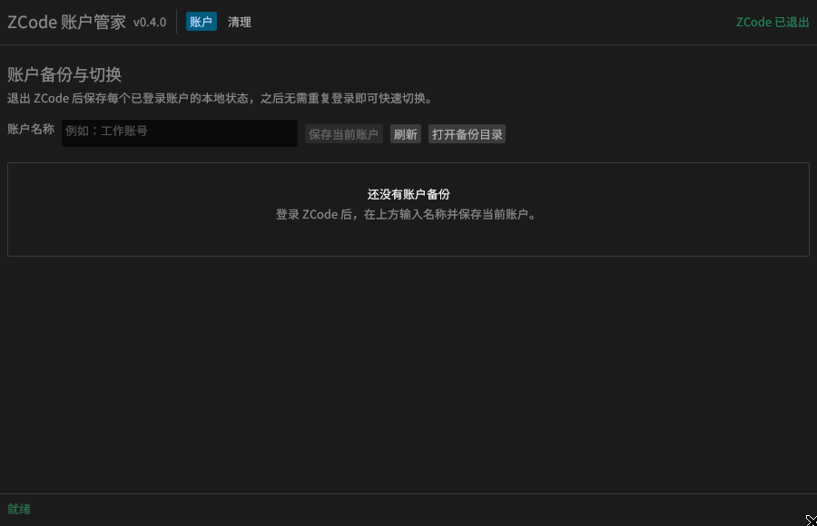
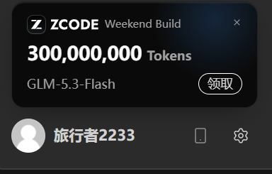

# ZCode 账户管家 (`zcode-account-manager`)

<p align="center">
  <b>一个界面管理多个 ZCode 账户：一键备份、快速切换、安全清理，本地状态始终可控。</b>
</p>

<p align="center">
  <a href="https://github.com/beyondcy1013/zcode-account-manager/stargazers"></a>
  <a href="https://github.com/beyondcy1013/zcode-account-manager/issues"></a>
  <a href="https://github.com/beyondcy1013/zcode-account-manager/blob/main/LICENSE"></a>
</p>

---

## 📌 项目简介 (About)

在使用 **ZCode (智谱 BigModel 编程客户端 / Z.ai)** 时，很多开发者遇到以下痛点：
- **换号/切换多账号困难**：客户端经常记住旧账号的 Cookie 和 OAuth Token，无法干净退出或切换。
- **无法弹出新用户免费 Flash 套餐引导**：老账号登录过的机器残留了本地权益缓存（`coding-plan-cache.json`），即使换了新账号也不会弹出新版免费套餐领取界面。
- **环境残留与排错困难**：本地缓存损坏导致客户端无法拉取最新 Plan 或报错。

**`zcode-account-manager`**（原 `zcode-fresh-reset`）是一个原生 Windows 图形化账户管理工具。它可以为每个已登录账户保存独立的本地状态快照，在多个账户之间快速切换，同时保留原有的一键重置与安全清理能力。

## 账户备份与切换

双击 `zcode-account-manager.exe` 即进入 GUI，无需命令行：

1. 登录一个 ZCode 账户并完全退出 ZCode。
2. 输入容易识别的账户名称，点击 **保存当前账户**。
3. 登录并保存其他账户，列表会集中展示所有账户快照。
4. 以后退出 ZCode，在列表中点击 **切换**，再重新启动 ZCode 即可。

切换前，工具会自动更新当前账户快照并创建安全备份；目标账户恢复失败时会自动回滚。账户凭据不会显示在界面中，快照保存在 `%USERPROFILE%\.zcode\account_backups\`。

> 账户快照包含登录凭据和 Cookie，请像保护密码一样保护备份目录，不要上传或分享。



---

## 🔍 深度原理解析 (Why & How)

### 1. 为什么“新安装客户端”会弹出领取 Flash 免费套餐？
- **本地机制**：当客户端检测不到 `credentials.json`、`session/Cookies` 和 `coding-plan-cache.json` 时，判定当前为“首次启动未初始化状态”，会自动激活新手引导及套餐领取弹窗。
- **云端校验**：免费 Flash 套餐最终由 BigModel / ZCode 云端根据账号（UID/手机号/OAuth）和设备特征进行核验下发。

### 2. 为什么登录过的账号不会再弹出？
- **本地有缓存**：`coding-plan-cache.json` 记录了旧套餐数据，客户端启动直接读缓存，不再请求新引导。
- **云端有记录**：同一个账号在服务端已被标记为“已领过”或“老用户”。

### 3. 正确的“新用户领取”操作流程
1. 完全退出 ZCode，运行 **`zcode-account-manager.exe clean`**，彻底清理本地老账号状态。
2. 启动 ZCode 客户端，此时客户端处于纯净新机状态。
3. 登录**未领取过该福利的新账号**，客户端将正常触发新用户新手引导并成功领取免费 Flash 套餐。

---

## 📂 涉及的关键路径清单

| 类别 | Windows 路径 | 作用说明 |
| :--- | :--- | :--- |
| **登录凭据** | `%USERPROFILE%\.zcode\v2\credentials.json` | 用户登录 Token 与授权身份 |
| **套餐缓存** | `%USERPROFILE%\.zcode\v2\coding-plan-cache.json` | 缓存的 Plan 权益与领取状态 |
| **遥测埋点** | `%USERPROFILE%\.zcode\v2\telemetry-state.json` | 本地客户端状态数据 |
| **网页会话** | `%APPDATA%\ZCode\session\Cookies` | Electron 登录态 Cookie |
| **页面存储** | `%APPDATA%\ZCode\session\Local Storage\` | 前端页面持久化数据 |
| **设备特征** | `%APPDATA%\ZCode\rum-electron-store\` | 客户端设备监控与特征信息 |
| **升级标记** | `%APPDATA%\ZCode\.updaterId` | 客户端更新器标识 |

---

## 🚀 快速上手 (Quick Start)

发布文件 `zcode-account-manager.exe` 不需要 Python 或其他运行时。

直接双击 EXE 会打开 **ZCode 账户管家**。账户页用于备份、更新、切换和删除账户快照；清理页提供安全清理和完整重置。所有会改动本地状态的操作都有明确状态反馈和二次确认。

## 多语言与自动更新

命令行兼容模式仍保留；设置环境变量 `ZCODE_LANG=en` 后显示英文交互文本。程序内置 GitHub Release 更新地址，可运行 `zcode-account-manager.exe --check-update` 手动检查；`ZCODE_UPDATE_MANIFEST_URL` 可覆盖默认地址。清单格式：

```json
{"version":"0.5.0","url":"https://github.com/beyondcy1013/zcode-account-manager/releases/latest/download/zcode-account-manager-0.5.0.exe"}
```

## 清理效果示例

下图为清理前的 ZCode 套餐界面示例。清理本机登录态、会话和权益缓存后，重新登录符合条件的新账号时，客户端会重新执行首次启动权益检测；最终资格仍由 ZCode 服务端账号策略决定。



### 1. 打开图形界面
```bash
zcode-account-manager.exe
```

### 2. 查看当前状态
```bash
zcode-account-manager.exe inspect
```

### 3. 一键完整重置
> ⚠️ **注意**：执行前请确保已**完全退出 ZCode 客户端**。默认会自动在 `%USERPROFILE%\.zcode\reset_backups\` 下建立完整备份。
```bash
zcode-account-manager.exe clean
```

### 4. 安全模式（仅清理套餐缓存，不影响当前登录凭据）
```bash
zcode-account-manager.exe clean --safe
```

### 5. 仅备份配置
```bash
zcode-account-manager.exe backup
```

### 6. 从源码构建
```bash
cargo test
cargo build --release
```

生成文件位于 `target\release\zcode-account-manager.exe`。仓库中的 GitHub Actions 也会在推送 `v*` 标签时构建 Windows x86_64 EXE。

---

## 🤝 交流与联系 (Contact & Author)

如果您在使用过程中遇到任何问题，或者有功能建议，欢迎联系与交流：

- **GitHub Issues**: [提交 Issue](https://github.com/beyondcy1013/zcode-account-manager/issues)
- **GitHub 主页**: [@beyondcy1013](https://github.com/beyondcy1013)
- **项目仓库**: [https://github.com/beyondcy1013/zcode-account-manager](https://github.com/beyondcy1013/zcode-account-manager)

🌟 如果这个项目对你有帮助，欢迎在 GitHub 点个 **Star** 支持一下！

---

## 📄 开源协议 (License)

本项目采用 [MIT License](LICENSE) 协议开源。
